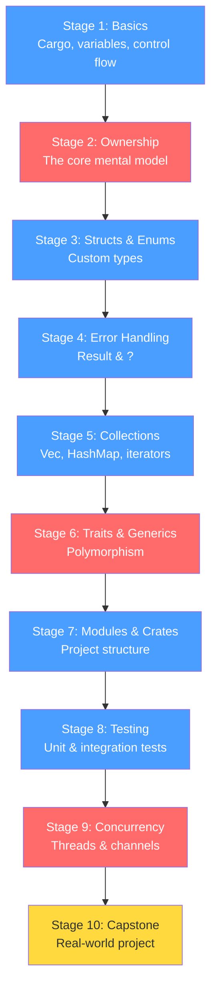
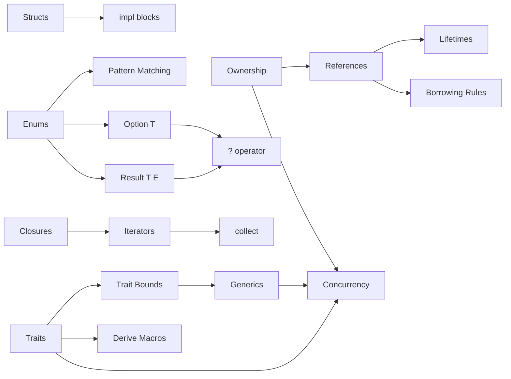

# Rust Learning Plan

## Overview

| Stage | Topic | Key Concept | Exercise | Status |
|-------|-------|-------------|----------|--------|
| 1 | Setup & Basics | Cargo, variables, control flow | Guessing game (CLI) | Not Started |
| 2 | Ownership & Borrowing | Move semantics, references, lifetimes | String manipulation tool | Not Started |
| 3 | Structs, Enums & Matching | Type system, Option\<T\>, pattern matching | Task tracker (Todo CLI) | Not Started |
| 4 | Error Handling | Result\<T,E\>, `?` operator, custom errors | CSV file parser | Not Started |
| 5 | Collections & Iterators | Vec, HashMap, closures, iterator chains | Word frequency counter | Not Started |
| 6 | Traits & Generics | Trait bounds, polymorphism, derive macros | Plugin system | Not Started |
| 7 | Modules & Crates | Project structure, crates.io, pub/mod | Refactor into multi-module | Not Started |
| 8 | Testing | Unit/integration tests, doc tests | Test all previous projects | Not Started |
| 9 | Concurrency | Threads, channels, Mutex, Arc | Parallel file search | Not Started |
| 10 | Capstone | Combine everything | CLI tool / HTTP server / CRUD app | Not Started |

## Learning Path

> Red = hardest stages (expect to spend more time here). Blue = standard. Yellow = capstone.

## Concept Dependencies

---

## Stage 1: Hello Rust — Setup & Basics
**Goal**: Get comfortable with Cargo, variables, types, and control flow
**Docs**: [docs/stage-01-basics.md](docs/stage-01-basics.md)
**Concepts**:
- Cargo (new, build, run, test)
- Variables, mutability (`let` vs `let mut`)
- Scalar types: i32, f64, bool, char
- Compound types: tuples, arrays
- Functions and return values
- if/else, loops (loop, while, for)
**Exercise**: Build a number guessing game (CLI)
**Status**: Not Started

## Stage 2: Ownership & Borrowing (The Big One)
**Goal**: Understand Rust's core memory model
**Docs**: [docs/stage-02-ownership.md](docs/stage-02-ownership.md)
**Concepts**:
- Ownership rules (each value has one owner)
- Move semantics vs Copy
- References (`&T`) and mutable references (`&mut T`)
- Borrowing rules (one mutable OR many immutable)
- Lifetimes (intro — don't go deep yet)
- The String vs &str distinction
**Exercise**: Build a string manipulation tool that demonstrates ownership transfers
**Status**: Not Started

## Stage 3: Structs, Enums & Pattern Matching
**Goal**: Model real-world data with Rust's type system
**Docs**: [docs/stage-03-structs-enums.md](docs/stage-03-structs-enums.md)
**Concepts**:
- Defining and instantiating structs
- Methods and associated functions (impl blocks)
- Enums with data variants
- Pattern matching with `match` (exhaustive matching)
- `if let` and `while let` shorthand
- Option<T> — Rust's way of handling "null"
**Exercise**: Build a task tracker (Todo app in the terminal)
**Status**: Not Started

## Stage 4: Error Handling
**Goal**: Handle errors the Rust way (no exceptions!)
**Docs**: [docs/stage-04-error-handling.md](docs/stage-04-error-handling.md)
**Concepts**:
- Result<T, E> type
- The `?` operator for error propagation
- Custom error types
- `unwrap()` and `expect()` — when to use (and not use)
- `panic!` vs recoverable errors
**Exercise**: Build a CSV file parser with proper error handling
**Status**: Not Started

## Stage 5: Collections & Iterators
**Goal**: Work with dynamic data structures and functional-style processing
**Docs**: [docs/stage-05-collections.md](docs/stage-05-collections.md)
**Concepts**:
- Vec<T>, HashMap<K,V>, HashSet<T>
- Iterator trait and adapter methods (map, filter, fold, collect)
- Closures (anonymous functions)
- Iterator chaining
- Consuming vs borrowing iterators
**Exercise**: Build a word frequency counter that reads text files
**Status**: Not Started

## Stage 6: Traits & Generics
**Goal**: Write reusable, polymorphic code
**Docs**: [docs/stage-06-traits-generics.md](docs/stage-06-traits-generics.md)
**Concepts**:
- Defining and implementing traits
- Default implementations
- Trait bounds on generics (`fn foo<T: Display>(x: T)`)
- `impl Trait` syntax (argument position and return position)
- Deriving common traits (Debug, Clone, PartialEq)
- Where clauses for complex bounds
**Exercise**: Build a plugin system with trait objects
**Status**: Not Started

## Stage 7: Modules, Crates & Project Structure
**Goal**: Organize code like a real Rust project
**Docs**: [docs/stage-07-modules.md](docs/stage-07-modules.md)
**Concepts**:
- Modules (mod, pub, use)
- File-based module structure
- Crate vs package distinction
- Using external crates from crates.io
- Cargo.toml dependencies
- Documentation comments (///)
**Exercise**: Refactor previous exercises into a well-structured multi-module project
**Status**: Not Started

## Stage 8: Testing
**Goal**: Write idiomatic Rust tests
**Docs**: [docs/stage-08-testing.md](docs/stage-08-testing.md)
**Concepts**:
- Unit tests (#[test], #[cfg(test)])
- Integration tests (tests/ directory)
- Test organization patterns
- assert!, assert_eq!, assert_ne!
- Testing error conditions (#[should_panic])
- Documentation tests
**Exercise**: Add comprehensive tests to previous projects
**Status**: Not Started

## Stage 9: Concurrency
**Goal**: Write safe concurrent code
**Docs**: [docs/stage-09-concurrency.md](docs/stage-09-concurrency.md)
**Concepts**:
- Threads (std::thread)
- Message passing (channels: mpsc)
- Shared state (Mutex<T>, Arc<T>)
- Send and Sync traits (why Rust concurrency is safe)
- Fearless concurrency — what the compiler prevents
**Exercise**: Build a parallel file search tool (mini grep)
**Status**: Not Started

## Stage 10: Capstone Project
**Goal**: Combine everything into a real-world application
**Docs**: [docs/stage-10-capstone.md](docs/stage-10-capstone.md)
**Project options** (pick one):
- A CLI tool (using `clap` crate) — e.g., a markdown link checker
- A simple HTTP server (using `axum` or `actix-web`)
- A database-backed CRUD app (using `sqlx`)
**Status**: Not Started

---

## Resources
- [The Rust Book](https://doc.rust-lang.org/book/) — the official guide (free)
- [Rust by Example](https://doc.rust-lang.org/rust-by-example/) — learn by reading examples
- [Rustlings](https://github.com/rust-lang/rustlings) — small exercises to practice
- `cargo doc --open` — read docs for any crate locally
